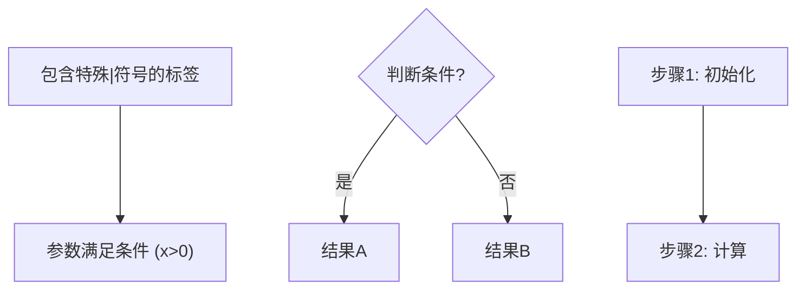

# HTML复习文档完整模板

## CSS样式

```html
<!DOCTYPE html>
<html lang="zh-CN">
<head>
<meta charset="UTF-8">
<meta name="viewport" content="width=device-width, initial-scale=1.0">
<title>[课程中文名] ([英文缩写]) [考试类型]复习完全指南</title>
<script>
window.MathJax = {
  tex: {
    inlineMath: [['$', '$'], ['\\(', '\\)']],
    displayMath: [['$$', '$$'], ['\\[', '\\]']],
  }
};
</script>
<script>
MathJax.startup = {
  ready() { MathJax.startup.defaultReady(); }
};
</script>
<script id="MathJax-script" async src="https://cdn.jsdelivr.net/npm/mathjax@3/es5/tex-svg.js"></script>
<script>
// CDN fallback if jsdelivr unreachable (e.g. mainland China)
document.getElementById('MathJax-script').addEventListener('error', function() {
  var fallback = document.createElement('script');
  fallback.id = 'MathJax-script';
  fallback.async = true;
  fallback.src = 'https://cdn.bootcdn.net/ajax/libs/mathjax/3.2.2/es5/tex-svg.min.js';
  this.remove();
  document.head.appendChild(fallback);
});
</script>
<noscript>
  <p style="color: #c41e3a; text-align: center; padding: 1rem; border: 2px dashed #c41e3a;">
    ⚠ 此文档需要 JavaScript 才能正确渲染数学公式。请启用 JavaScript 或使用现代浏览器打开。
  </p>
</noscript>
<!-- Mermaid Diagram Rendering -->
<script src="https://cdn.jsdelivr.net/npm/mermaid@10/dist/mermaid.min.js"></script>
<script>
document.addEventListener('DOMContentLoaded', function() {
  mermaid.initialize({
    startOnLoad: true,
    theme: 'base',
    securityLevel: 'sandbox',
    themeVariables: {
      primaryColor: '#eff6ff',
      primaryBorderColor: '#2563eb',
      primaryTextColor: '#1e293b',
      secondaryColor: '#f8fafc',
      secondaryBorderColor: '#64748b',
      lineColor: '#3b82f6',
      fontFamily: 'system-ui, -apple-system, "Segoe UI", "Noto Sans SC", sans-serif',
      fontSize: '15px'
    }
  });
});
</script>
<style>
  /* ===== CSS Variables ===== */
  :root {
    --primary: #2563eb;
    --primary-dark: #1d4ed8;
    --primary-light: #eff6ff;
    --secondary: #d97706;
    --secondary-light: #fffbeb;
    --accent: #dc2626;
    --accent-light: #fef2f2;
    --bg: #ffffff;
    --bg-soft: #f8fafc;
    --bg-card: #ffffff;
    --text: #334155;
    --text-heading: #1e293b;
    --text-muted: #64748b;
    --border: #e2e8f0;
    --shadow-sm: 0 1px 2px rgba(0,0,0,0.05);
    --shadow: 0 1px 3px rgba(0,0,0,0.1), 0 1px 2px rgba(0,0,0,0.06);
    --shadow-md: 0 4px 6px rgba(0,0,0,0.07), 0 2px 4px rgba(0,0,0,0.06);
    --radius: 8px;
    --radius-lg: 12px;
    --max-width: 960px;
    --toc-width: 240px;
    --font-body: system-ui, -apple-system, "Segoe UI", "Noto Sans SC", "PingFang SC", "Microsoft YaHei", sans-serif;
    --font-mono: "JetBrains Mono", "Fira Code", "Cascadia Code", "Consolas", monospace;
  }

  /* ===== Reset & Base ===== */
  *, *::before, *::after { box-sizing: border-box; margin: 0; padding: 0; }
  html { scroll-behavior: smooth; font-size: 16px; }
  body {
    font-family: var(--font-body);
    color: var(--text);
    background: #f1f5f9;
    line-height: 1.8;
    letter-spacing: -0.01em;
    text-wrap: pretty;
  }

  /* ===== Hero Header ===== */
  .hero {
    background: linear-gradient(135deg, #1e40af 0%, #3b82f6 40%, #6366f1 100%);
    color: #fff;
    padding: 3rem 2rem;
    margin-bottom: 2rem;
    text-align: center;
  }
  .hero h1 {
    font-size: 2.5rem;
    font-weight: 800;
    color: #fff;
    margin: 0 0 0.75rem;
    letter-spacing: -0.02em;
    border: none;
    padding: 0;
  }
  .hero .hero-subtitle {
    font-size: 1.1rem;
    opacity: 0.85;
    margin-bottom: 1.5rem;
  }
  .hero .meta-card {
    display: inline-flex;
    flex-wrap: wrap;
    gap: 0.5rem 1.5rem;
    background: rgba(255,255,255,0.12);
    backdrop-filter: blur(8px);
    border-radius: var(--radius-lg);
    padding: 1rem 1.5rem;
    font-size: 0.9rem;
    text-align: left;
    justify-content: center;
  }
  .hero .meta-card .meta-item { white-space: nowrap; }
  .hero .meta-card strong { color: rgba(255,255,255,0.7); font-weight: 500; }

  /* ===== Page wrapper (sticky ToC on wide screens) ===== */
  .page-wrapper {
    max-width: calc(var(--max-width) + var(--toc-width) + 3rem);
    margin: 0 auto;
    padding: 0 1.5rem 4rem;
    display: flex;
    gap: 2rem;
    align-items: flex-start;
  }

  /* ===== Sticky ToC ===== */
  .toc-sidebar {
    position: sticky;
    top: 1rem;
    width: var(--toc-width);
    flex-shrink: 0;
    background: var(--bg);
    border: 1px solid var(--border);
    border-radius: var(--radius-lg);
    padding: 1.2rem 1rem;
    box-shadow: var(--shadow-sm);
    max-height: calc(100vh - 2rem);
    overflow-y: auto;
    font-size: 0.88rem;
    display: none;
  }
  @media (min-width: 1200px) {
    .toc-sidebar { display: block; }
  }
  .toc-sidebar h2 {
    font-size: 1rem;
    margin: 0 0 0.75rem;
    border: none;
    padding: 0;
    color: var(--text-heading);
  }
  .toc-sidebar ol { padding-left: 1.2rem; list-style: none; }
  .toc-sidebar li { margin: 0.25rem 0; line-height: 1.5; }
  .toc-sidebar a { color: var(--text-muted); text-decoration: none; transition: color 0.15s; }
  .toc-sidebar a:hover { color: var(--primary); }
  .toc-sidebar ol ol { padding-left: 0.8rem; font-size: 0.82rem; }
  .toc-sidebar ol ol li { margin: 0.15rem 0; }

  /* ===== Main content column ===== */
  .main-content { flex: 1; min-width: 0; }

  /* ===== Hero-header ToC (mobile fallback) ===== */
  .toc-inline {
    background: var(--bg-soft);
    border: 1px solid var(--border);
    border-radius: var(--radius-lg);
    padding: 1rem 1.5rem;
    margin: 1.5rem 0;
  }
  @media (min-width: 1200px) {
    .toc-inline { display: none; }
  }
  .toc-inline h2 { margin-top: 0; border: none; padding: 0; font-size: 1.1rem; }
  .toc-inline ol { padding-left: 1.5rem; }
  .toc-inline li { margin: 0.3rem 0; line-height: 1.6; }
  .toc-inline ol ol { padding-left: 1.2rem; font-size: 0.92rem; }

  /* ===== Typography ===== */
  h1 {
    font-size: 2.2rem;
    font-weight: 800;
    color: var(--primary-dark);
    border-bottom: 2px solid var(--border);
    padding-bottom: 0.5rem;
    margin: 2.5rem 0 1rem;
    letter-spacing: -0.015em;
  }
  h2 {
    font-size: 1.65rem;
    font-weight: 700;
    color: var(--text-heading);
    margin: 2.5rem 0 1rem;
    padding-left: 0.75rem;
    border-left: 4px solid var(--primary);
  }
  h3 { font-size: 1.2rem; font-weight: 600; color: var(--text-heading); margin: 1.8rem 0 0.8rem; }
  h4 { font-size: 1.05rem; font-weight: 600; color: var(--text-muted); margin: 1.2rem 0 0.5rem; }
  p { margin: 0.7rem 0; }
  a { color: var(--primary); text-decoration: none; }
  a:hover { text-decoration: underline; }

  /* ===== Chapter Cards ===== */
  .chapter-card {
    background: var(--bg-card);
    border: 1px solid var(--border);
    border-radius: var(--radius-lg);
    box-shadow: var(--shadow-sm);
    padding: 1.5rem 2rem;
    margin: 2rem 0;
    transition: box-shadow 0.2s;
  }
  .chapter-card:hover { box-shadow: var(--shadow); }
  .chapter-card h2 { margin-top: 0; border: none; padding-left: 0; }

  /* ===== Blockquote (Intuition) ===== */
  blockquote {
    border-left: 4px solid var(--primary);
    background: var(--primary-light);
    margin: 1.2rem 0;
    padding: 1rem 1.2rem;
    border-radius: 0 var(--radius-lg) var(--radius-lg) 0;
    color: #1e40af;
  }
  blockquote::before { content: "💡 "; font-weight: bold; }

  /* ===== Code ===== */
  code {
    font-family: var(--font-mono);
    background: var(--bg-soft);
    padding: 0.15em 0.4em;
    border-radius: 4px;
    font-size: 0.9em;
  }
  pre {
    background: #1e293b;
    color: #e2e8f0;
    padding: 1.2rem;
    border-radius: var(--radius-lg);
    overflow-x: auto;
    margin: 1rem 0;
    line-height: 1.6;
  }
  pre code { background: none; padding: 0; color: inherit; }

  /* ===== Tables ===== */
  table {
    width: 100%;
    border-collapse: collapse;
    margin: 1.2rem 0;
    font-size: 0.92rem;
    border-radius: var(--radius-lg);
    overflow: hidden;
    box-shadow: var(--shadow-sm);
  }
  th, td { border: 1px solid var(--border); padding: 0.7rem 0.9rem; text-align: left; }
  th { background: var(--primary); color: #fff; font-weight: 600; }
  tr:nth-child(even) { background: var(--bg-soft); }

  /* ===== Images ===== */
  img {
    max-width: 100%;
    height: auto;
    border-radius: var(--radius-lg);
    box-shadow: var(--shadow);
    margin: 1.2rem 0;
    display: block;
    border: 1px solid var(--border);
    transition: transform 0.2s ease;
  }
  img:hover { transform: scale(1.01); }
  figure { margin: 1.5rem 0; }
  figcaption { text-align: center; font-size: 0.88rem; color: var(--text-muted); margin-top: 0.4rem; }

  /* ===== SVG Diagrams ===== */
  .diagram-container {
    text-align: center;
    margin: 1.5rem 0;
    padding: 1rem;
    background: var(--bg-soft);
    border-radius: var(--radius-lg);
  }
  .diagram-container svg { max-width: 100%; height: auto; }

  /* ===== Mermaid Diagrams ===== */
  .mermaid-container {
    text-align: center;
    margin: 1.5rem 0;
    padding: 1rem;
    background: var(--bg-soft);
    border-radius: var(--radius-lg);
    overflow-x: auto;
  }
  .mermaid-container svg {
    max-width: 100%;
    height: auto;
  }

  /* ===== Exam Points Summary Table ===== */
  .exam-points-summary {
    margin-top: 1.5rem;
    padding-top: 1.5rem;
    border-top: 2px dashed var(--border);
  }
  .exam-points-summary h3 {
    color: var(--primary);
  }

  /* ===== Callout Boxes ===== */
  .callout {
    margin: 1.2rem 0;
    padding: 1rem 1.2rem;
    border-radius: var(--radius-lg);
    border-left: 5px solid;
    box-shadow: var(--shadow-sm);
  }
  .callout-def     { background: #eff6ff; border-color: #3b82f6; }
  .callout-key     { background: #fffbeb; border-color: #d97706; }
  .callout-derive  { background: #f0fdf4; border-color: #16a34a; }
  .callout-example { background: #fef2f2; border-color: #dc2626; }
  .callout-warn    { background: #fff7ed; border-color: #ea580c; }

  /* ===== Badges ===== */
  .badge { display: inline-block; padding: 0.2em 0.6em; border-radius: 12px; font-size: 0.82rem; font-weight: 600; }
  .badge-exam    { background: #fee2e2; color: #991b1b; }
  .badge-important { background: #fef3c7; color: #92400e; }

  /* ===== Interactive: Collapsible Derivation Steps ===== */
  details.derive-steps {
    margin: 1rem 0;
    border: 1px solid var(--border);
    border-radius: var(--radius);
    background: var(--bg-soft);
  }
  details.derive-steps > summary {
    padding: 0.8rem 1rem;
    font-weight: 600;
    cursor: pointer;
    color: var(--primary);
    list-style: none;
    display: flex;
    align-items: center;
    gap: 0.5rem;
    user-select: none;
  }
  details.derive-steps > summary::before {
    content: "▶";
    font-size: 0.75rem;
    transition: transform 0.2s;
  }
  details.derive-steps[open] > summary::before { transform: rotate(90deg); }
  details.derive-steps > .derive-content {
    padding: 0.5rem 1rem 1rem;
    border-top: 1px solid var(--border);
  }

  /* ===== Interactive: Tabbed Content ===== */
  .tab-container { margin: 1.5rem 0; }
  .tab-buttons { display: flex; gap: 0; border-bottom: 2px solid var(--border); }
  .tab-btn {
    padding: 0.6rem 1.2rem;
    background: none;
    border: none;
    cursor: pointer;
    font-size: 0.92rem;
    font-weight: 600;
    color: var(--text-muted);
    border-bottom: 2px solid transparent;
    margin-bottom: -2px;
    transition: color 0.2s, border-color 0.2s;
    font-family: var(--font-body);
  }
  .tab-btn.active { color: var(--primary); border-bottom-color: var(--primary); }
  .tab-panel { display: none; padding: 1rem 0; }
  .tab-panel.active { display: block; }

  /* ===== Interactive: Quiz ===== */
  .quiz-section {
    margin: 2rem 0;
    border: 2px solid var(--primary-light);
    border-radius: var(--radius-lg);
    padding: 1.5rem;
    background: #fafbff;
  }
  .quiz-section h3 { color: var(--primary); }
  .quiz-item {
    margin: 1rem 0;
    padding: 1rem;
    background: var(--bg);
    border-radius: var(--radius);
    border: 1px solid var(--border);
  }
  details.quiz-answer { margin-top: 0.8rem; }
  details.quiz-answer > summary {
    cursor: pointer;
    font-weight: 600;
    color: var(--secondary);
    user-select: none;
    padding: 0.3rem 0;
  }
  details.quiz-answer > .answer-content {
    padding: 0.8rem 1rem;
    margin-top: 0.5rem;
    background: var(--secondary-light);
    border-radius: var(--radius);
  }

  /* ===== Interactive: Flashcard ===== */
  .flashcard-grid {
    display: grid;
    grid-template-columns: repeat(auto-fill, minmax(220px, 1fr));
    gap: 1rem;
    margin: 1.5rem 0;
  }
  .flashcard {
    perspective: 600px;
    height: 160px;
    cursor: pointer;
  }
  .flashcard-inner {
    position: relative;
    width: 100%;
    height: 100%;
    transition: transform 0.5s;
    transform-style: preserve-3d;
  }
  .flashcard.flipped .flashcard-inner { transform: rotateY(180deg); }
  .flashcard-front, .flashcard-back {
    position: absolute;
    width: 100%;
    height: 100%;
    backface-visibility: hidden;
    border-radius: var(--radius);
    display: flex;
    align-items: center;
    justify-content: center;
    padding: 1rem;
    text-align: center;
    font-size: 0.95rem;
  }
  .flashcard-front {
    background: var(--primary-light);
    border: 2px solid var(--primary);
    color: var(--primary-dark);
    font-weight: 700;
  }
  .flashcard-back {
    background: var(--secondary-light);
    border: 2px solid var(--secondary);
    transform: rotateY(180deg);
    font-size: 0.88rem;
  }

  /* Flashcard click protection: prevent inner elements from blocking click event */
  .flashcard-front *, .flashcard-back * {
    pointer-events: none;
    user-select: none;
  }
  .flashcard-front, .flashcard-back {
    cursor: pointer;
    user-select: none;
  }

  /* ===== Interactive: Progress Tracker ===== */
  .progress-tracker {
    margin-bottom: 1rem;
    padding-bottom: 1rem;
    border-bottom: 1px solid var(--border);
  }
  .progress-bar-container {
    background: var(--bg-soft);
    border-radius: 20px;
    height: 8px;
    margin: 0.5rem 0;
    overflow: hidden;
  }
  .progress-bar-fill {
    height: 100%;
    background: linear-gradient(90deg, var(--primary), #6366f1);
    border-radius: 20px;
    width: 0%;
    transition: width 0.4s ease;
  }
  .progress-text {
    font-size: 0.85rem;
    color: var(--text-muted);
    text-align: center;
  }
  .section-checkbox {
    display: flex;
    align-items: center;
    gap: 0.5rem;
    font-size: 0.88rem;
    margin: 0.3rem 0;
    cursor: pointer;
  }
  .section-checkbox input[type="checkbox"] {
    accent-color: var(--primary);
    width: 1rem;
    height: 1rem;
  }

  /* ===== Interactive: Search ===== */
  .search-container { margin: 1rem 0 1.5rem; position: relative; }
  .search-input {
    width: 100%;
    padding: 0.6rem 1rem 0.6rem 2.2rem;
    border: 1px solid var(--border);
    border-radius: var(--radius);
    font-size: 0.92rem;
    font-family: var(--font-body);
    background: var(--bg);
    transition: border-color 0.2s;
  }
  .search-input:focus { outline: none; border-color: var(--primary); }
  .search-icon {
    position: absolute;
    left: 0.7rem;
    top: 50%;
    transform: translateY(-50%);
    color: var(--text-muted);
    font-size: 0.9rem;
    pointer-events: none;
  }

  /* ===== MathJax formula breathing room ===== */
  mjx-container { padding: 0.15rem 0; }

  /* ===== Footer ===== */
  .page-footer {
    text-align: center;
    color: var(--text-muted);
    font-size: 0.85rem;
    margin-top: 3rem;
    padding-top: 1.5rem;
    border-top: 1px solid var(--border);
  }

  /* ===== Autonomous Mode Banner ===== */
  .autonomous-banner {
    background: linear-gradient(90deg, #fef3c7, #fde68a);
    border: 2px solid #f59e0b;
    border-radius: var(--radius-lg);
    padding: 1rem 1.5rem;
    margin: 1rem 0;
    text-align: center;
  }

  /* ===== Print Styles ===== */
  @media print {
    body { background: #fff; }
    .hero { background: #fff !important; color: #000; border-bottom: 3px solid #000; padding: 1rem 0; }
    .hero h1 { color: #000; }
    .hero .meta-card { background: #f5f5f5; border: 1px solid #ccc; color: #000; }
    .hero .meta-card strong { color: #555; }
    .toc-sidebar { display: none; }
    .toc-inline { border: 1px solid #ccc; background: #fff; }
    .page-wrapper { max-width: none; padding: 0; display: block; }
    .main-content { max-width: none; }
    .chapter-card { box-shadow: none; border: 1px solid #ccc; break-inside: avoid; page-break-before: always; }
    .callout { box-shadow: none; break-inside: avoid; }
    img, svg, figure { break-inside: avoid; max-width: 90%; }
    img:hover { transform: none; }
    a { color: var(--text); }
    pre { white-space: pre-wrap; }
    h1 { font-size: 20pt; } h2 { font-size: 15pt; } h3 { font-size: 12pt; }
    details.derive-steps { display: block; }
    details.derive-steps > summary::before { display: none; }
    details.derive-steps > .derive-content { display: block; padding: 0; border: none; }
    .tab-buttons { display: none; }
    .tab-panel { display: block !important; }
    .quiz-section { border: 1px solid #ccc; background: #fff; }
    details.quiz-answer > .answer-content { display: block; }
    .flashcard { perspective: none; height: auto; break-inside: avoid; }
    .flashcard-inner { transform: none !important; transform-style: flat; }
    .flashcard-front, .flashcard-back { position: relative; backface-visibility: visible; }
    .flashcard-back { transform: none; margin-top: 0.5rem; }
    .progress-tracker { display: none; }
    .search-container { display: none; }
  }

  /* ===== Responsive ===== */
  @media (max-width: 768px) {
    .hero { padding: 2rem 1rem; }
    .hero h1 { font-size: 1.6rem; }
    .hero .meta-card { padding: 0.75rem 1rem; gap: 0.25rem 1rem; font-size: 0.82rem; }
    .page-wrapper { padding: 0 0.8rem 2rem; display: block; }
    .chapter-card { padding: 1rem 1.2rem; }
    h1 { font-size: 1.5rem; } h2 { font-size: 1.25rem; }
    table { font-size: 0.82rem; }
    th, td { padding: 0.4rem 0.5rem; }
  }
</style>
</head>
<body>
```

## HTML骨架

```html
<!-- ===== Hero 封面 ===== -->
<header class="hero">
  <h1>[课程中文名] 复习完全指南</h1>
  <p class="hero-subtitle">[英文课程名] · [考试类型]考试</p>
  <div class="meta-card">
    <span class="meta-item"><strong>📋 考试范围</strong> [章节范围]</span>
    <span class="meta-item"><strong>🚫 不考</strong> [排除章节]</span>
    <span class="meta-item"><strong>📝 形式</strong> [开/闭]卷笔试</span>
    <span class="meta-item"><strong>👨‍🏫 教师</strong> [姓名]</span>
    <span class="meta-item"><strong>📚 教材</strong> [书名]</span>
    <span class="meta-item"><strong>📅 生成时间</strong> [日期]</span>
  </div>
</header>

<div class="page-wrapper">

<!-- ===== 侧边栏目录（宽屏固定）===== -->
<nav class="toc-sidebar">
  <h2>📑 目录</h2>
  <div class="progress-tracker">
    <div class="progress-bar-container"><div class="progress-bar-fill"></div></div>
    <div class="progress-text">0/N sections completed (0%)</div>
  </div>
  <ol>
    <li><label class="section-checkbox"><input type="checkbox" data-section="reading-guide"><a href="#reading-guide">📖 阅读指南</a></label></li>
    <li><label class="section-checkbox"><input type="checkbox" data-section="ch0"><a href="#ch0">第〇章：课程核心思维</a></label></li>
    <!-- 各章节checkbox，每章一个 -->
    <li><label class="section-checkbox"><input type="checkbox" data-section="appendix-a"><a href="#appendix-a">附录A：公式速查卡</a></label></li>
    <li><label class="section-checkbox"><input type="checkbox" data-section="appendix-b"><a href="#appendix-b">附录B：解题模板</a></label></li>
    <li><label class="section-checkbox"><input type="checkbox" data-section="appendix-c"><a href="#appendix-c">附录C：常见错误与陷阱</a></label></li>
  </ol>
</nav>

<main class="main-content">

<!-- ===== 搜索栏 ===== -->
<div class="search-container">
  <span class="search-icon">🔍</span>
  <input type="text" class="search-input" placeholder="搜索概念、公式、术语...">
</div>

<!-- ===== 阅读指南 ===== -->
<div class="reading-guide-section">
  <h2 id="reading-guide">📖 阅读指南</h2>
  <blockquote>
    <strong>如果你基础薄弱，请按以下路径复习：</strong><br>
    1. 先快速浏览所有带 📌 标记的核心概念，无需深究细节<br>
    2. 重点理解 🔑 标记的关键关系和 📐 标记的完整推导<br>
    3. 动手做 ✏️ 标记的例题，做完再看解答<br>
    4. 最后用附录快速查漏补缺
  </blockquote>
</div>

<!-- ===== 目录（窄屏内联）===== -->
<div class="toc-inline">
  <h2>📑 目录</h2>
  <ol>
    <li><a href="#ch0">第〇章：开始之前——课程核心思维</a></li>
    <!-- 各章节由实际课件填充 -->
    <li><a href="#appendix-a">附录A：公式速查卡</a></li>
    <li><a href="#appendix-b">附录B：解题模板</a></li>
    <li><a href="#appendix-c">附录C：常见错误与陷阱</a></li>
  </ol>
</div>
```

## 第〇章模板

```html
<!-- ===== 第〇章：课程核心思维 ===== -->
<div class="chapter-card">
<h2 id="ch0">第〇章：开始之前——课程核心思维</h2>

<h3>📌 [课程名]的一条主线</h3>
<div class="diagram-container">
  <!-- 优先使用课件中的系统架构图；如课件无图，用简单SVG流程图补充 -->
</div>

<h3>🔑 最重要的关系</h3>
<p>课程最核心的1-3个定理/公式及它们之间的关系。</p>

<h3>📌 为什么要学这些？</h3>
<p>建立学习动机：这些知识解决什么实际问题。</p>

<h3>📌 各章节关系图</h3>
<!-- 章节间的依赖和递进关系 -->
</div>
```

## 每章模板

```html
<!-- ===== 第N章 ===== -->
<div class="chapter-card">
<h2 id="chN">第N章：[章节名] <span class="badge badge-note">[对应课件文件名]</span></h2>
<blockquote><strong>本章核心任务</strong>: [一句话概括本章在课程中的角色]</blockquote>

<div class="tab-container">
  <div class="tab-buttons">
    <button class="tab-btn active">⚡ 快速复习</button>
    <button class="tab-btn">📖 详细讲解</button>
  </div>

  <!-- ⚡ 快速复习面板 -->
  <div class="tab-panel active">
    <p><strong>章节概要</strong>：[2-3句话概括本章要点]</p>

    <div class="flashcard-grid">
      <div class="flashcard">
        <div class="flashcard-inner">
          <div class="flashcard-front">[术语/概念名]</div>
          <div class="flashcard-back">[一句话定义或核心公式]</div>
        </div>
      </div>
      <!-- 每章3-5张闪卡 -->
    </div>

    <h3>🔑 本章关键公式</h3>
    <table>
      <tr><th>公式</th><th>名称</th><th>说明</th></tr>
      <tr><td>$$\boxed{[公式]}$$</td><td>[名称]</td><td>[一句话说明]</td></tr>
    </table>
  </div>

  <!-- 📖 详细讲解面板 -->
  <div class="tab-panel">

<!-- N.M 小节——每个核心概念一个，遵循5层结构 -->
<h3 id="chN-M">📌 [概念中文名] ([English Term])</h3>

<div class="callout callout-def">
  <p><strong>1. 定义</strong>：[精确的数学定义，用通俗语言复述至少2遍]</p>
  <p>$$[核心公式，置于 \boxed{} 中]$$</p>
</div>

<figure>
  
  <figcaption>图 N.M：[结合上下文的说明]（来源：[课件文件名]）</figcaption>
</figure>
<p>如上图所示，[对图片内容的具体解释，与当前讲解的概念建立关联]。</p>

<!-- 当概念涉及流程/层级/架构关系时，使用 Mermaid 替代或补充静态截图 -->
<div class="mermaid-container">
<pre><code class="language-mermaid">
graph TD
    A["[根概念/起点]"] --> B["[分支/步骤1]"]
    A --> C["[分支/步骤2]"]
    B --> D["[子节点/下一步]"]
</code></pre>
</div>
<p>如上图所示，[对Mermaid图内容的解释，说明各节点之间的关系]。</p>

<p><strong>2. 物理意义</strong>：[这个概念到底描述了什么物理现象？用生活中的类比解释]</p>

<p><strong>3. 数学表达拆解</strong>：
<br>• $x$：[含义]，单位：[单位]，取值范围：[范围]
<br>• $y$：[含义]，单位：[单位]，取值范围：[范围]
<br>• ...（每个符号第一次出现时必须说明）</p>

<p><strong>4. 适用条件与限制</strong>：
<br>✅ 什么时候可以用：[列出3-5个适用场景]
<br>❌ 什么时候不能用：[列出2-3个常见误用场景]
<br>⚠️ 使用时必须注意：[列出2-3个关键注意事项]</p>

<p><strong>5. 与其他概念的关联</strong>：
<br>• 前置知识 → 见 <a href="#chX-Y">第X章 Y节</a>
<br>• 后续延伸 → 见 <a href="#chZ-W">第Z章 W节</a>
<br>• 易混淆：[与XX的区别是什么]</p>

<!-- 可折叠推导 -->
<details class="derive-steps">
  <summary>📐 推导：[定理/公式名]的完整推导（共N步）</summary>
  <div class="derive-content">
    <p><strong>推导目标</strong>：[从什么推导出什么]</p>
    <p><strong>推导前提</strong>：[前置公式、假设条件]</p>
    <hr>
    <p><strong>第1步</strong>：[做了什么操作]
    <br><em>为什么这一步？</em> [基于什么原理，目的是什么]
    <br>$$[完整的中间表达式，不要跳步]$$</p>
    <p><strong>第2步</strong>：...
    <br><em>为什么这一步？</em> [...]</p>
    <!-- 不少于5步 -->
    <hr>
    <p><strong>推导要点总结</strong>：[最关键技巧 + 最容易出错的步骤]</p>
  </div>
</details>

<!-- 例题 -->
<div class="callout callout-example">
  <p>✏️ <strong>例题</strong>：[完整题目描述，包含已知条件、所求问题]</p>
  <p><strong>📌 考点分析</strong>：[核心知识点、使用公式、解题思路]</p>
  <p><strong>💡 解题策略选择</strong>：[为什么选这种方法？]</p>
  <p><strong>解</strong>：</p>
  <p><strong>步骤1：[明确的步骤名称]</strong></p>
  <p><em>为什么这一步？</em> [基于什么原理]</p>
  <p>$$[完整的中间计算过程]$$</p>
  <p><strong>步骤2：...</strong></p>
  <!-- 以此类推 -->
  <p><strong>最终结果</strong>：$$\boxed{[最终答案]}$$</p>
  <p><strong>✅ 验证方法</strong>：[如何验证答案]</p>
  <p><strong>⚠️ 易错点</strong>：[2-3个学生常犯错误及避免方法]</p>
  <p><strong>💡 拓展思考</strong>：[条件变化时的调整思路]</p>
</div>

  </div><!-- .tab-panel 详细讲解 -->
</div><!-- .tab-container -->

<!-- 练习测验 -->
<div class="quiz-section">
  <h3>📝 练习检测</h3>
  <div class="quiz-item">
    <p><strong>Q1.</strong> [概念检查题]</p>
    <details class="quiz-answer">
      <summary>显示答案</summary>
      <div class="answer-content"><p>[答案及解析]</p></div>
    </details>
  </div>
  <!-- 每章2-4道练习题 -->
</div>

<!-- 高频考点汇总 -->
<div class="exam-points-summary">
  <h3>🎯 高频考点汇总（第N章）</h3>
  <table>
    <tr><th>考点</th><th>重要度</th><th>考查形式</th></tr>
    <tr><td>[考点名称]</td><td>★★★</td><td>[考查形式]</td></tr>
    <tr><td>[考点名称]</td><td>★★</td><td>[考查形式]</td></tr>
    <tr><td>[考点名称]</td><td>★</td><td>[考查形式]</td></tr>
  </table>
</div>

</div><!-- .chapter-card -->
```

## 附录模板

```html
<!-- ===== 附录A：公式速查卡 ===== -->
<div class="chapter-card">
<h2 id="appendix-a">附录A：公式速查卡</h2>
<h3>A1. [主题1]</h3>
<table>
  <tr><th>公式</th><th>名称</th><th>说明</th></tr>
  <tr><td>$$\boxed{[公式]}$$</td><td>[名称]</td><td>[一句话说明用途和条件]</td></tr>
</table>
</div>

<!-- ===== 附录B：解题模板 ===== -->
<div class="chapter-card">
<h2 id="appendix-b">附录B：解题模板</h2>
<h3>B1. [题型名称]</h3>
<p><strong>适用场景</strong>: [什么时候用这个模板]</p>
<p><strong>解题步骤</strong>：</p>
<ol>
  <li><strong>[步骤名]</strong>：[具体操作]</li>
</ol>
</div>

<!-- ===== 附录C：常见错误 ===== -->
<div class="chapter-card">
<h2 id="appendix-c">附录C：常见错误与陷阱</h2>
<table>
  <tr><th>#</th><th>常见错误</th><th>为什么错</th><th>正确做法</th></tr>
  <tr><td>1</td><td>[学生常犯错误]</td><td>[错误原因]</td><td>[正确做法]</td></tr>
</table>
</div>
```

## 页脚与JavaScript

```html
<!-- ===== 页脚 ===== -->
<!-- 🔴 禁止包含项目作者姓名 -->
<div class="page-footer">
  <p>本文档由 AI 助手基于课程课件自动生成 | [生成日期]<br>
  内容仅供参考，请以教材和教师授课为准</p>
</div>

</main><!-- .main-content -->
</div><!-- .page-wrapper -->

<script>
// === Tab Switching ===
document.querySelectorAll('.tab-container').forEach(function(container) {
  var buttons = container.querySelectorAll('.tab-btn');
  var panels = container.querySelectorAll('.tab-panel');
  buttons.forEach(function(btn, i) {
    btn.addEventListener('click', function() {
      buttons.forEach(function(b) { b.classList.remove('active'); });
      panels.forEach(function(p) { p.classList.remove('active'); });
      btn.classList.add('active');
      panels[i].classList.add('active');
    });
  });
});

// === Flashcard Flip (event delegation — 禁止在HTML中使用内联onclick) ===
// 🔴 这是唯一的翻转触发点。HTML中绝对不能添加onclick——会导致点击一次翻转两次（视觉上"没翻转"）
document.addEventListener('click', function(e) {
  if (e.target.tagName === 'A' || e.target.tagName === 'INPUT' ||
      e.target.tagName === 'BUTTON' || e.target.closest('a, button, details')) {
    return;
  }
  var card = e.target.closest('.flashcard');
  if (card) {
    e.stopPropagation();
    if (card.dataset.flipping) return;
    card.dataset.flipping = '1';
    setTimeout(function() { delete card.dataset.flipping; }, 300);
    card.classList.toggle('flipped');
  }
});

// === Progress Tracker ===
(function() {
  var checkboxes = document.querySelectorAll('.section-checkbox input[type="checkbox"]');
  var total = checkboxes.length;
  var fill = document.querySelector('.progress-bar-fill');
  var text = document.querySelector('.progress-text');
  function updateProgress() {
    var checked = document.querySelectorAll('.section-checkbox input:checked').length;
    var pct = total > 0 ? Math.round((checked / total) * 100) : 0;
    if (fill) fill.style.width = pct + '%';
    if (text) text.textContent = checked + '/' + total + ' sections completed (' + pct + '%)';
    try {
      var state = {};
      checkboxes.forEach(function(cb, i) { state['sec_' + i] = cb.checked; });
      localStorage.setItem('review_progress_' + location.pathname, JSON.stringify(state));
    } catch(e) {}
  }
  try {
    var saved = JSON.parse(localStorage.getItem('review_progress_' + location.pathname) || '{}');
    checkboxes.forEach(function(cb, i) { if (saved['sec_' + i]) cb.checked = true; });
  } catch(e) {}
  checkboxes.forEach(function(cb) { cb.addEventListener('change', updateProgress); });
  updateProgress();
})();

// === Search/Filter ===
(function() {
  var input = document.querySelector('.search-input');
  if (!input) return;
  input.addEventListener('input', function() {
    var query = this.value.trim().toLowerCase();
    var searchTargets = document.querySelectorAll('.chapter-card, .reading-guide-section, .toc-inline, .hero');
    if (!query) {
      searchTargets.forEach(function(el) { el.style.display = ''; });
      return;
    }
    searchTargets.forEach(function(el) {
      var txt = el.textContent.toLowerCase();
      el.style.display = txt.includes(query) ? '' : 'none';
    });
  });
})();

// === MathJax Re-render on Details Toggle ===
document.querySelectorAll('details.derive-steps, details.quiz-answer').forEach(function(det) {
  det.addEventListener('toggle', function() {
    if (det.open && window.MathJax && MathJax.typesetPromise) {
      MathJax.typesetPromise([det]).catch(function() {});
    }
  });
});

// === Mermaid Re-render on Details Toggle ===
// When a collapsed section containing a Mermaid diagram is expanded,
// the diagram may need re-rendering since it was hidden during page load.
document.querySelectorAll('details.derive-steps, details.quiz-answer').forEach(function(det) {
  det.addEventListener('toggle', function() {
    if (det.open) {
      try {
        // Find any Mermaid elements inside the just-opened details
        var mermaidEls = det.querySelectorAll('.mermaid-container pre code.language-mermaid');
        if (mermaidEls.length > 0 && window.mermaid) {
          // Re-initialize Mermaid to render newly visible diagrams
          window.mermaid.run({ nodes: Array.from(mermaidEls).map(function(el) { return el.parentElement; }) });
        }
      } catch(e) {}
    }
  });
});
</script>

</body>
</html>
```

## Python追加脚本模板

**🔴 必须使用三双引号 `"""..."""`，严禁使用 `r'''...'''`（raw triple single quotes）。**

```python
# -*- coding: utf-8 -*-
content = """
[HTML内容——JS中的单引号 ' 在Python三双引号中无需任何转义，直接书写即可]
"""
with open('[目标文件].html', 'a', encoding='utf-8') as f:
    f.write(content)
print('ChX-Y appended')
```

**为什么禁止 `r'''...'''`**：JavaScript 大量使用单引号 `'` 作为字符串分隔符（如 `addEventListener('click', ...)`, `getElementById('search')`, `classList.toggle('active')` 等）。在 Python `r'''...'''` raw string 中，连续单引号 `''` 会被原样写入文件，导致浏览器中的 JS 代码变成 `addEventListener(''click'', ...)` 而非 `addEventListener('click', ...)`——这是一个**静默的JS语法错误**，页面不会报错但所有交互功能失效。

使用 `"""..."""` 三双引号后，JS 中的 `'` 在 Python 字符串中无需任何转义，直接写即可，从根本上避免此问题。

---

## Mermaid 安全语法规则

> **重要性**：Mermaid 解析器对未引号包裹的特殊字符极其敏感。一个裸露的 `|` `_` `()` `{}` 就能导致整个图表渲染失败。生成每个 Mermaid 代码块时必须逐节点检查。

### 必须用双引号包裹的字符

以下字符出现在节点标签文本中时，**整个标签必须用双引号 `"..."` 包裹**：

```
|  _  =  {  }  (  )  <  >  #  ^  :  ,  *
```

### 安全字符（无需引号）

- 纯中文文本（不含上述特殊符号）
- 纯英文单词
- 纯数字

### 正确示例



### 错误示例（会导致渲染失败）

```mermaid
graph TD
    A[包含特殊|符号的标签] --> B[参数满足条件 (x>0)]
    C{判断条件?} -->|是| D[结果A]
```

以上错误示例中：节点 A 的 `|`、节点 B 的 `(` `)`、边标签 `是` 虽然没有特殊字符，但边标签最好也养成引号习惯以防万一。

### 决策节点语法

菱形决策节点使用 `{}` 包裹，标签同样遵循引号规则：

```
C{"描述文本"}
```

### 边标签语法

```
A -->|"标签文本"| B
```

边标签含特殊字符时必须用引号包裹。建议始终给边标签加引号，养成安全习惯。

### HTML 嵌入格式

在 HTML 文档中，Mermaid 图表使用以下格式：

```html
<div class="mermaid-container">
<pre><code class="language-mermaid">
graph TD
    A["起点"] --> B["终点"]
</code></pre>
</div>
```

关键点：
- 外层使用 `<div class="mermaid-container">` 包裹
- 内层使用 `<pre><code class="language-mermaid">` 标记
- Mermaid 代码不要缩进过多（会影响解析）
